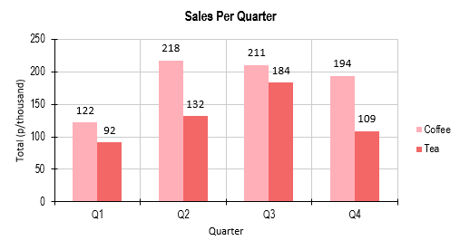
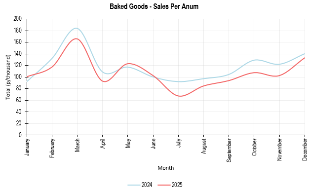
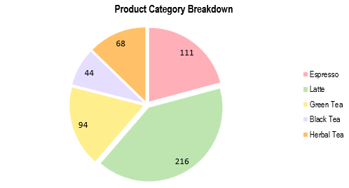

# 🛠️ ChartCraft
Simplifying Apache POI for effortless chart creation in Java


ChartCraft extends Apache POI to simplify chart creation in Excel. 

It reduces the amount of code required and removes the need for direct XML interactions, making chart generation faster, safer, and more readable.

## 🚀 Features
- Minimal boilerplate: create charts with far less code than raw Apache POI
- Abstracts away direct XML manipulation, reducing errors
- Supports line, bar, and pie charts with easy styling
- Fully compatible with Apache POI 5.x

## 🖼️ Example Charts

### Bar Chart



### Line Chart



### Pie Chart



### Scatter Chart


---

## 📦 Installation

### Maven
```xml
<dependency>
    <groupId>com.seanfullerr</groupId>
    <artifactId>chartcraft</artifactId>
    <version>1.0.0</version>
</dependency>
