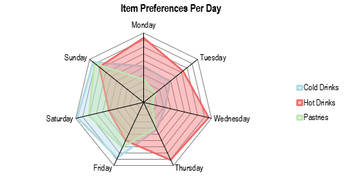

# 🛠️ ChartCraft
Simplifying Apache POI for effortless chart creation in Java


ChartCraft extends Apache POI to simplify chart creation in Excel. 

It reduces the amount of code required and removes the need for direct XML interactions, making chart generation faster, safer, and more readable.

## 🚀 Features
- Minimal boilerplate: create charts with far less code than raw Apache POI
- Abstracts away direct XML manipulation, reducing errors
- Supports line, bar, and pie charts with easy styling
- Fully compatible with Apache POI 5.x

## 🖼️ Example Charts


### 📊 Radar Chart
#### Code Snippet
```java
TO BE ADDED
```
#### Result


### 📊 Bar Chart

#### Code Snippet
```java
BarChart bc = new BarChart();	
bc.setTitle("Treats - Stock Levels");	
bc.setCategories(treatTypes);	
bc.setData(totalSales);	
bc.setSpan(span[0], span[1]);	
bc.setPosition(pos[0], pos[1]);		
bc.setRgb(colour);	
bc.setLegendPosition(LegendPosition.BOTTOM);	
bc.setSeriesTitles(treatTypes);	
bc.setDisplayDataLabels(true);
bc.setxAxisRotation(-45);
```

#### Result


### 📊 Pie Chart

#### Code Snippet
```java
TO BE ADDED
```
#### Result


### 📊 Line Chart

#### Code Snippet
```java
TO BE ADDED
```
#### Result


### 📊 Scatter Chart

#### Code Snippet
```java
TO BE ADDED
```
#### Result


---

## 📦 Installation

### Maven
```xml
<dependency>
    <groupId>com.seanfullerr</groupId>
    <artifactId>chartcraft</artifactId>
    <version>1.0.0</version>
</dependency>
